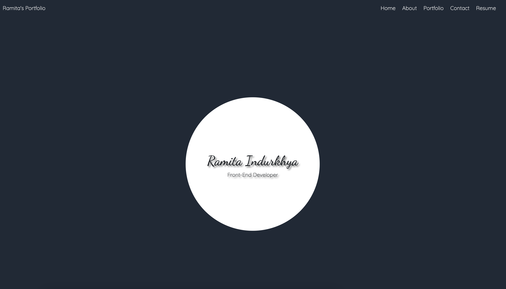

# React Portfolio

## UCLA Bootcamp Module 20 Challenge

## Description

This is a portfolio website. Upon loading the landing page, the user can navigate to:

1. The About page, which has a detailed story of my journey into web development, as well as a recent avatar.
2. The Portfolio page, which showcases six applications with links to the deployed applications and GitHub repositories.
3. The Contact page, where the user can submit a message via a contact form.
4. The Resume page, which has a link to my resume for download, as well as a list of front-end and back-end proficiencies.
5. Any of the Footer links, which lead to GitHub, LinkedIn and Stack Overflow.

## Installation

To install, run `npm install`.

To start, run `npm start`.

## Usage

This project has been deployed at: https://indurkhya-portfolio.netlify.app/

## Credits

This project was created by Ramita Indurkhya.
